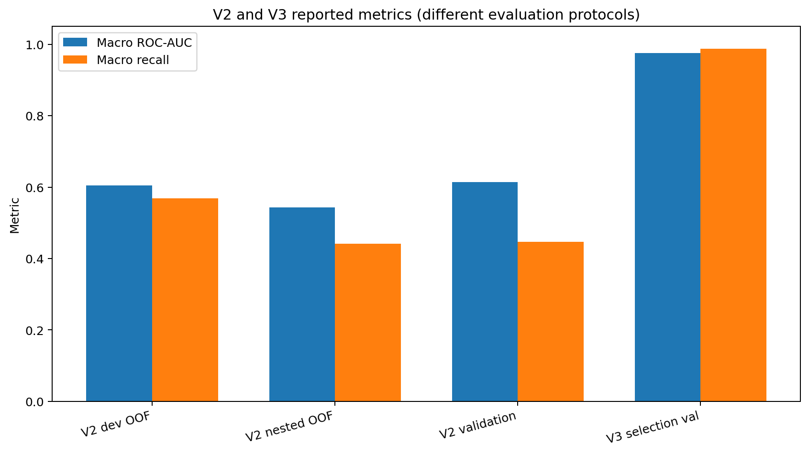
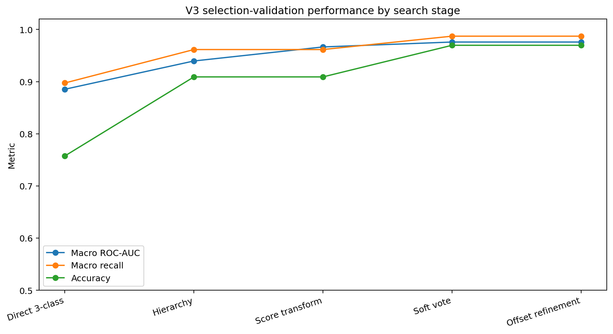
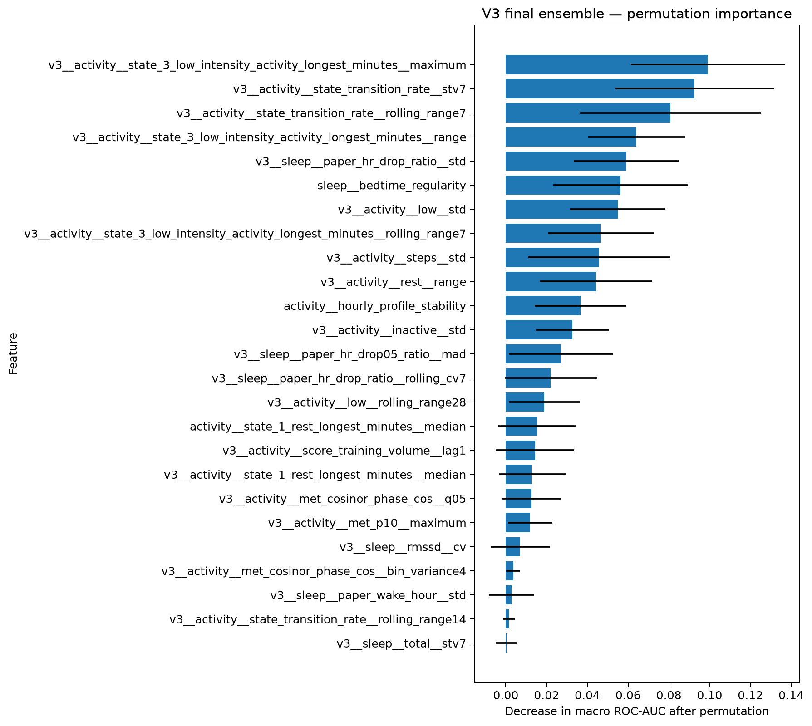
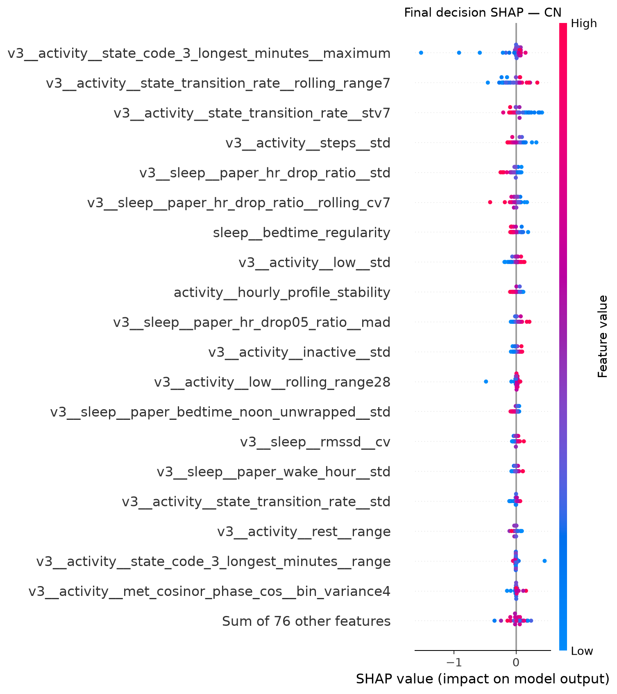
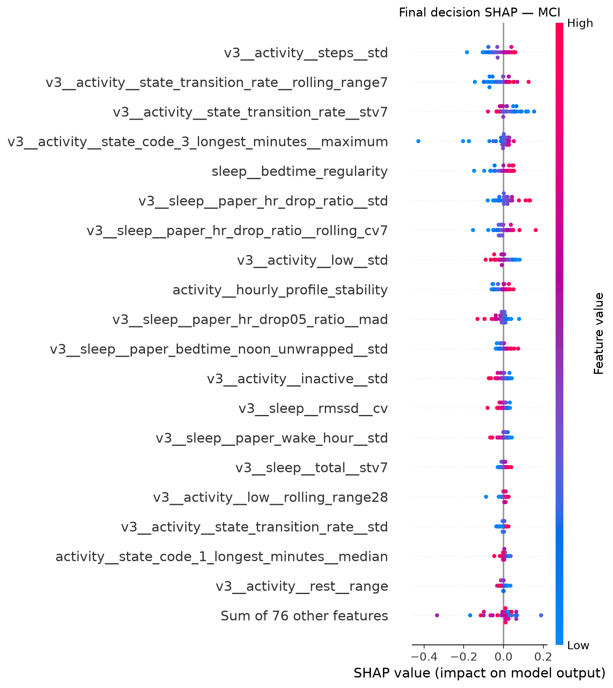
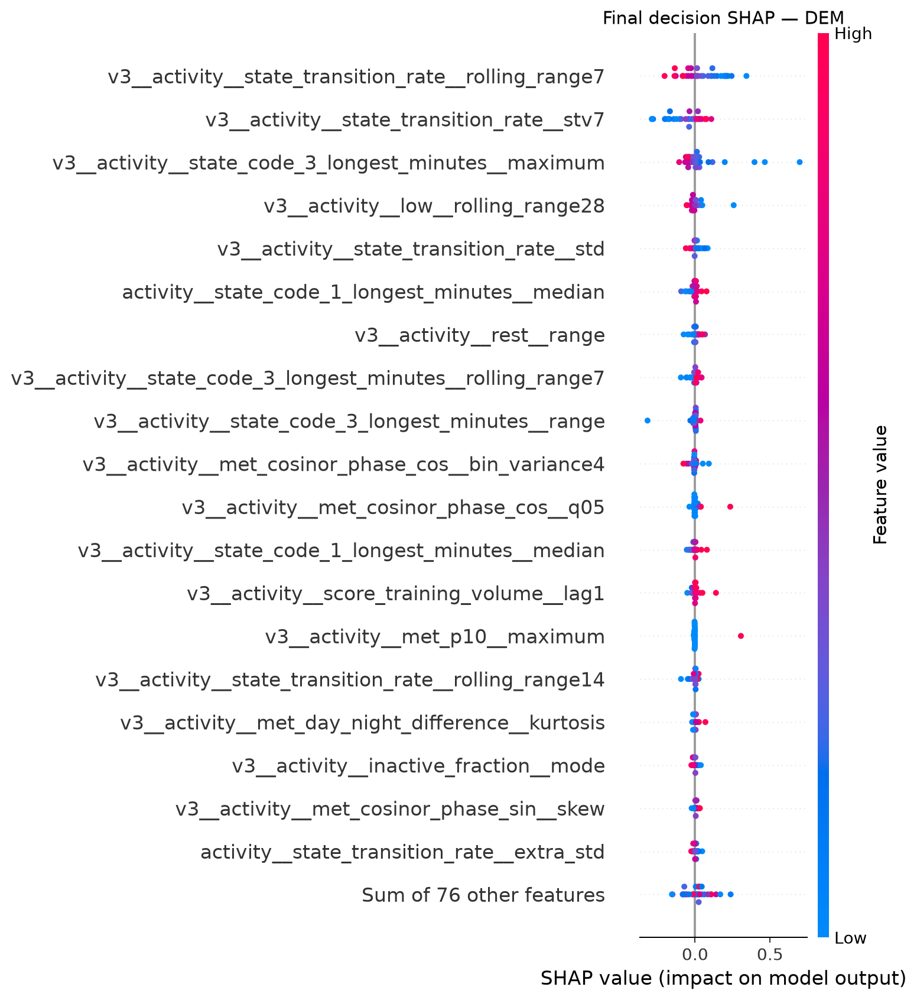
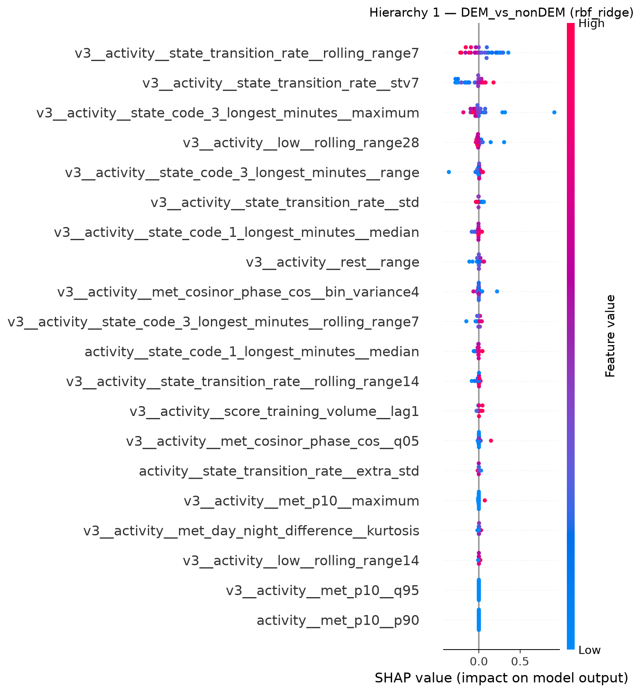
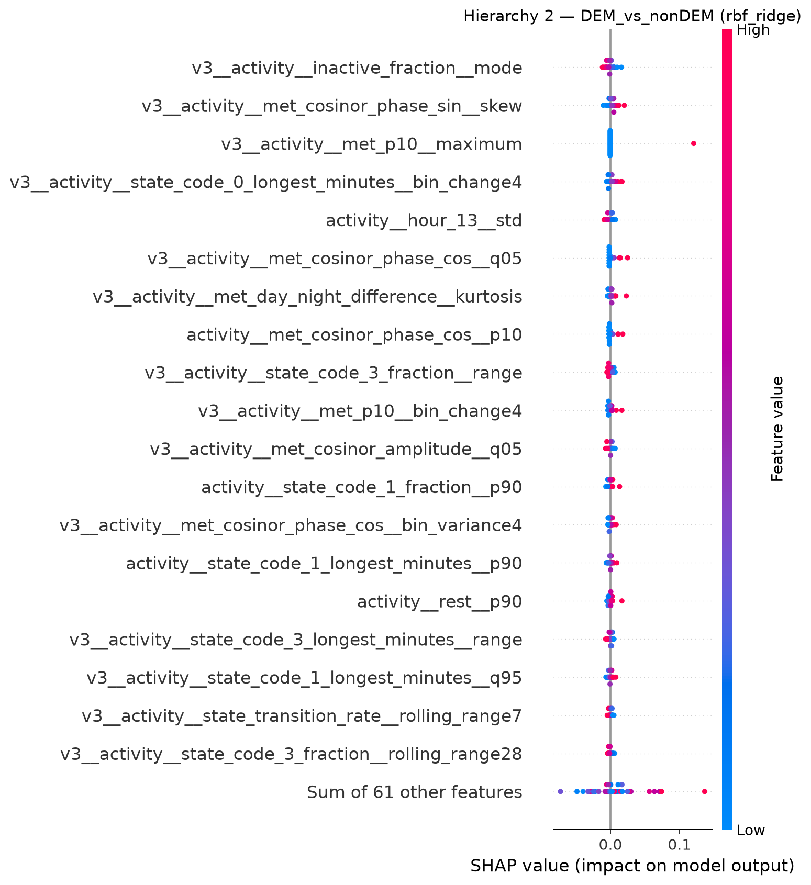
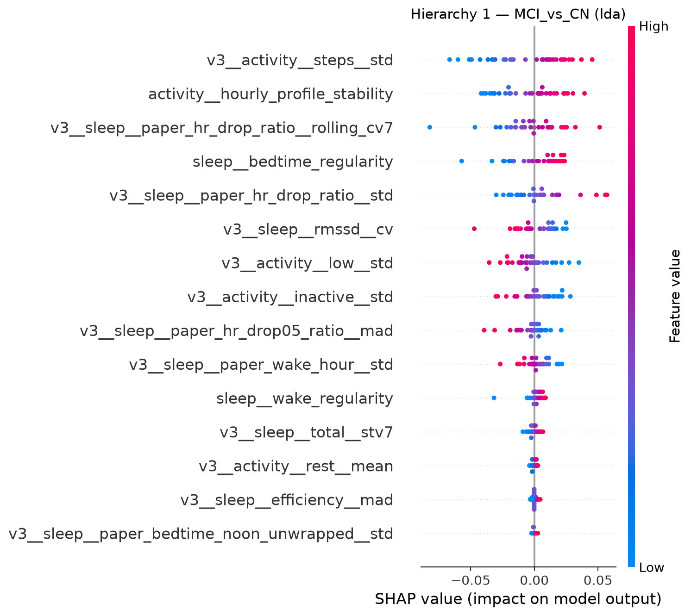
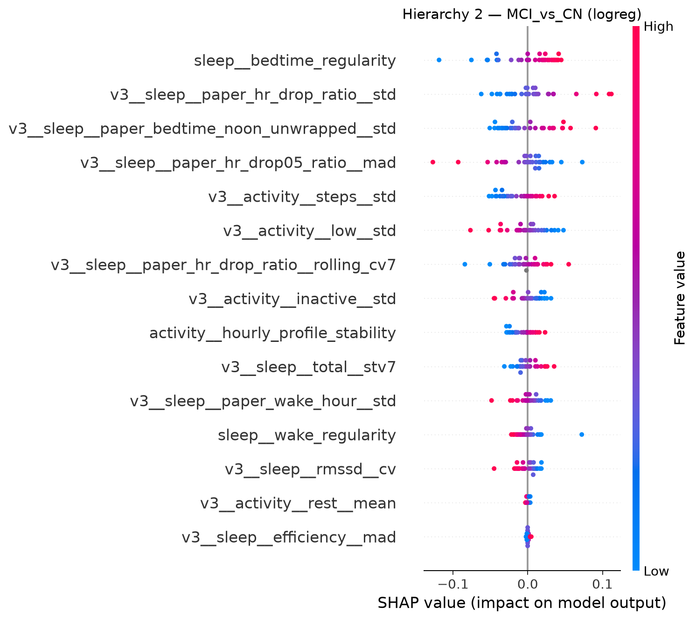

# 웨어러블 라이프로그 기반 CN·MCI·DEM 3-class 분류 최종 실험 보고서

> **최종 정리 범위:** V2 → V3 실험 흐름, 데이터·전처리·feature engineering·모델 탐색·선택·앙상블·의사결정 구현, 최종 성능, Permutation Importance, SHAP 분석  
> **기준일:** 2026-09-23  
> **분석 대상:** 현재 제공 데이터 기준 **174명**  
> **핵심 제약:** **피험자 단위 독립 분할 유지 + MMSE 미사용**  
> **중요:** 본 문서는 업로드된 V2/V3 소스코드, 실행 산출물, 실행 완료 SHAP 노트북 및 결과 CSV/PNG를 기준으로 작성하였다. 코드·산출물에 없는 임상적 사실이나 성능 원인은 임의로 추가하지 않았다.

---

## 0. 이 문서를 읽을 때 가장 먼저 알아야 할 것

이 프로젝트는 V2와 V3에서 **평가 목적 자체가 달라졌다.**

- **V2**의 목적은 가능한 한 엄격하게 일반화 성능을 확인하는 것이었다.
  - 피험자 단위 분할
  - No MMSE
  - Nested CV
  - 공식 Validation은 V2 설계 선택에 사용하지 않음
- **V3**의 목적은 프로젝트 목표 변경 후, 다음 두 조건을 고정하면서 **현재 고정 Training/Validation에서 3-class 성능을 최대화**하는 것으로 바뀌었다.
  - 피험자 단위 독립 분할
  - No MMSE
  - Nested CV는 필수 조건에서 제외
  - Validation label을 모델·하이퍼파라미터·score 변환·앙상블·decision offset 선택에 적극 사용

따라서 다음 두 숫자는 같은 의미로 직접 비교하면 안 된다.

- V2 Nested outer OOF AUC: **0.5431**
- V3 Selection Validation AUC: **0.9759**

V2는 일반화 추정에 가깝고, V3는 **selection-validation 최적화 결과**다.  
V3 결과는 매우 높지만, 코드 자체도 이를 **독립 테스트 성능으로 주장하지 않도록 명시**하고 있다.



---

# 1. 최종 결론 요약

## 1.1 데이터와 고정 조건

현재 실제 분석 데이터는 **174명**이다.

| Split | CN | MCI | DEM | 전체 |
|---|---:|---:|---:|---:|
| Training | 85 | 47 | 9 | **141** |
| Validation | 26 | 4 | 3 | **33** |
| 전체 | 111 | 51 | 12 | **174** |

Training과 Validation의 피험자 ID 교집합은 **0명**이다.

AI-Hub의 과거 구축 문서에는 300명이라는 설명이 있으나, 본 프로젝트에서는 사용자가 지정한 현재 수정 데이터 기준인 **174명**을 실제 분석대상 수로 사용한다. 300명에서 174명으로 변경된 구체적 공식 제외 사유는 현재 제공 문서에서 확인되지 않았으므로 본 보고서에서 임의로 설명하지 않는다.

## 1.2 No MMSE 최종 판정

현재 V2/V3 구현에서는 **MMSE를 predictor로 사용하지 않는다.**

확인된 구현은 다음과 같다.

1. V2 `resolve_paths()`는 Activity, Sleep, 각 라벨 파일만 탐색한다.
2. V2 데이터 fingerprint도 `activity`, `sleep`, `activity_label`, `sleep_label` 이외 입력을 거부한다.
3. 라벨 파일은 `SAMPLE_EMAIL`, `DIAG_NM` 두 열만 읽는다.
4. Activity/Sleep CSV는 allowlist 방식으로 필요한 wearable 열만 읽는다.
5. V3 `load_daily()`는 경로 문자열에 `mmse` 또는 `cognitivefunction`이 있으면 즉시 오류를 발생시킨다.
6. V3 최종 feature matrix에서 `mmse`, `diag`, `email`, `subject`, `timestamp`, `_date` 등의 금지 토큰이 predictor 이름에 남아 있지 않음을 assertion으로 확인한다.
7. V2와 V3 manifest에 기록된 실제 입력 hash에도 MMSE 파일이 없다.
8. V3 summary에 `MMSE_used: false`가 기록되어 있다.

따라서 **피험자 식별자는 grouping/split 확인에만 사용되고, MMSE는 모델 입력에 사용되지 않았다.**

## 1.3 V2와 V3의 최종 성능

### V2

| 평가 | Macro ROC-AUC | Macro Recall | Macro F1 | Accuracy | CN Recall | MCI Recall | DEM Recall |
| --- | --- | --- | --- | --- | --- | --- | --- |
| V2 개발 OOF (선택에 재사용) | 0.6047 | 0.5689 | 0.5149 | 0.5319 | 0.5294 | 0.5106 | 0.6667 |
| V2 Nested outer OOF | 0.5431 | 0.4418 | 0.3920 | 0.4965 | 0.6471 | 0.2340 | 0.4444 |
| V2 공식 Validation 재평가 | 0.6136 | 0.4466 | 0.4817 | 0.4242 | 0.4231 | 0.2500 | 0.6667 |

V2의 엄격한 Nested outer OOF에서는 특히 **MCI 분리 성능이 낮았다.**

- MCI Recall: **0.2340**
- MCI OVR AUC: **0.4819**

### V3

최종 Selection Validation 결과:

- Macro ROC-AUC: **0.975938**
- Macro Recall: **0.987179**
- Macro F1: **0.956427**
- Accuracy: **0.969697**
- CN Recall: **0.9615**
- MCI Recall: **1.0000**
- DEM Recall: **1.0000**

Confusion matrix:

| Actual \ Predicted | CN | MCI | DEM |
|---|---:|---:|---:|
| CN | **25** | 1 | 0 |
| MCI | 0 | **4** | 0 |
| DEM | 0 | 0 | **3** |

즉 Validation 33명 중 **32명**이 최종 decision rule에서 맞았다.

## 1.4 최종 모델의 핵심 구조

V3 champion은 단일 3-class 모델이 아니다.

**두 개의 hierarchical classifier를 class-wise soft voting한 3-class ensemble**이다.

```text
                    ┌─ DEM vs non-DEM model
Input features ─────┤
                    └─ CN vs MCI model
                           │
                    Hierarchy score 1
                           │
                           ├───────────────┐
                           │               │
                    Hierarchy score 2     │
                           │               │
                           └── class-wise soft vote
                                      │
                         P(CN), P(MCI), P(DEM)-like scores
                                      │
                         log(score) + class offsets
                                      │
                                CN / MCI / DEM
```

최종 4개 component는 다음과 같다.

| Hierarchy | 분기 | 모델 | Feature view | 선택 feature | 선택법 | 변환 | PCA 요청 | PCA 실효 상한 | 증강 | Branch AUC |
| --- | --- | --- | --- | --- | --- | --- | --- | --- | --- | --- |
| Hierarchy 1 | DEM vs non-DEM | rbf_ridge | activity | 20 | rfe | quantile | 없음 | 없음 | smote | 0.9889 |
| Hierarchy 1 | MCI vs CN | lda | compact | 15 | anova | signedlog | 없음 | 없음 | smote | 0.9135 |
| Hierarchy 2 | DEM vs non-DEM | rbf_ridge | activity | 80 | rfe | standard | 15 | 15 | none | 0.9889 |
| Hierarchy 2 | MCI vs CN | logreg | compact | 15 | anova | standard | 30 | 15 | none | 0.8942 |

> `PCA=30`은 설정값이다. CN/MCI Logistic Regression은 선택 feature가 15개이므로 코드상 실제 PCA component 수는 `min(30, 15, n-1)`로 제한되어 **15개**다.

---

# 2. 데이터 입력과 기본 전처리

## 2.1 실제 읽는 파일

V2/V3 모델 입력은 다음 범주로 제한된다.

- Activity source CSV
- Sleep source CSV
- Activity label CSV
- Sleep label CSV

인지기능/MMSE source CSV는 모델 입력 경로에 포함되지 않는다.

라벨은 `DIAG_NM`을 다음 순서로 정수화한다.

```text
CN  -> 0
MCI -> 1
DEM -> 2
```

피험자 이메일은 원문을 predictor로 사용하지 않고 SHA-256 기반의 subject key로 바꿔 grouping에 사용한다.

## 2.2 원시 row와 subject-day 정리

V2 audit 기준:

| Split | Modality | 입력 row | 중복 subject-date | 최종 kept row | 피험자 |
|---|---|---:|---:|---:|---:|
| Train | Activity | 9,705 | 0 | 9,705 | 141 |
| Train | Sleep | 9,705 | 11 | 9,694 | 141 |
| Validation | Activity | 2,478 | 0 | 2,478 | 33 |
| Validation | Sleep | 2,478 | 1 | 2,477 | 33 |

Sleep에 같은 피험자·같은 날짜 row가 여러 개면 코드에서 수면 duration이 긴 row를 우선 정렬하여 하나를 유지한다.  
Activity는 피험자·날짜·시작 시각 순으로 정렬 후 subject-date 중복을 제거한다.

## 2.3 최소 관측 기준

V2 feature extraction config:

```text
observation_days = None
min_days         = 7
csv_chunksize    = 256
```

즉 고정된 첫 35일만 사용하는 구조가 아니라, 현재 V2/V3 코드에서는 해당 split의 관측기간을 사용하되 **최소 7일** 관측이 필요하다.

## 2.4 활동 상태 코드

AI-Hub 데이터 정의와 코드에서 사용되는 `activity_class_5min` 상태는 다음과 같다.

| Code | 의미 |
|---:|---|
| 0 | non-wear |
| 1 | rest |
| 2 | inactive |
| 3 | low-intensity activity |
| 4 | medium-intensity activity |
| 5 | high-intensity activity |

따라서 최종 중요 feature의 `state_code_3`은 **저강도 활동**, `state_code_1`은 **휴식**으로 해석한다.

---

# 3. V2: 엄격한 검증을 우선한 실험

# 3.1 V2의 질문

V2가 묻는 질문은 다음과 같았다.

> **“MMSE를 제외하고 피험자를 완전히 분리했을 때, 현재 라이프로그 특징과 일반적인 ML 모델로 CN/MCI/DEM을 얼마나 일반화해서 구분할 수 있는가?”**

이를 위해 V2는 단순 한 번의 train/validation 평가가 아니라:

1. Development 5-fold OOF
2. Nested CV
   - Outer 5-fold
   - Inner 3-fold
3. 모든 모델 선택을 마친 뒤 기존 공식 Validation 평가

순서를 사용했다.

## 3.2 V2 representation

V2는 동일한 피험자 데이터에서 여러 표현을 만들었다.

| Representation | Train row | Train feature | Validation row | Validation feature | 설명 |
|---|---:|---:|---:|---:|---|
| `subject_v1` | 141 | 670 | 33 | 670 | 기본 피험자 요약 |
| `subject_plus` | 141 | 1,333 | 33 | 1,333 | 추가 분포·주말·시간대 feature |
| `window14` | 784 | 1,333 | 196 | 1,333 | 비중첩 14일 window |
| `window28` | 449 | 1,333 | 110 | 1,333 | 비중첩 28일 window |

Window representation에서도 같은 사람의 모든 window는 같은 fold에 남도록 `groups`를 유지한다.

### `subject_v1`의 주요 feature 유형

V2는 하루 단위 activity/sleep feature를 만든 뒤 피험자 단위로 요약한다.

예:

- median
- IQR
- p10 / p90
- missing fraction
- 일간 RMSSD
- trend per day
- consecutive lag-1
- activity/sleep coupling
- 시간대 MET 특성
- 취침·기상 시각의 원형(circular) 표현

### `subject_plus`의 추가 feature

각 일별 변수에 대해 추가로:

- mean
- std
- MAD
- CV
- weekend delta

를 만들며, 활동에 대해서는 24시간 각 hour의 MET mean/std도 추가한다.

## 3.3 V2 feature selection / preprocessing

V2의 `FoldProcessor`는 **각 CV training fold 안에서만** population 통계를 fit한다.

순서는 다음과 같다.

```text
Training subjects only
    ↓
Feature view 선택
    ↓
피험자별 중심값으로 usable feature 검사
    ↓
Training median으로 결측 처리
    ↓
ANOVA 또는 Mutual Information ranking
    ↓
Top-k
    ↓
선택적으로 correlation pruning
    ↓
선형 계열은 median/IQR 기반 scaling
    ↓
선택적으로 PCA
    ↓
Model fit
```

Window 모델에서도 feature ranking/결측/scale 계산 시 한 사람이 window가 많다는 이유로 전처리에 더 큰 영향을 주지 않도록 **피험자별 평균 feature vector를 먼저 만든 뒤** preprocessing statistics를 계산한다.

## 3.4 V2 class/sample weighting

V2 `subject_weights()`는 두 가지를 동시에 처리한다.

1. window가 여러 개인 사람도 전체 기여도가 과도하게 커지지 않도록 `1 / 해당 피험자의 row 수`
2. class balance 설정에 따라 class count의 역수 계열 가중치

`balance` 의미:

- `0.0`: class balancing 없음
- `0.5`: class frequency의 제곱근 수준 보정
- `1.0`: inverse-frequency 수준 보정

## 3.5 V2 사전 ablation 27개

V2는 Optuna 이전에 27개의 사전 정의 비교를 수행했다.

주요 축:

- physiology only
- quality 제외
- vendor score 제외
- coupling 제외
- activity only
- sleep only
- enhanced features
- top 50 / 100
- correlation 0.95
- 14/28일 window
- mean/geometric pooling
- class balance 변화
- 모델 family 변화
- SVM + PCA
- Mutual Information

V2 ablation에서 `A05_activity`는 최종 ensemble에도 포함되었다.

## 3.6 V2 모델 계열

V2 탐색 대상은 다음을 포함했다.

- CatBoost
- Logistic Regression
- RBF SVM
- ExtraTrees
- RandomForest
- HistGradientBoosting
- LDA
- Gaussian Naive Bayes
- Hierarchical CatBoost
- Hierarchical Logistic Regression

V2 hierarchical 모델은:

1. CN vs impaired(MCI+DEM)
2. impaired 내부에서 MCI vs DEM

의 2단계 구조였다.

## 3.7 V2 개발 탐색

V2 config:

```text
seed                 = 2026
development_folds    = 5
outer_folds          = 5
inner_folds          = 3
Optuna development   = 80 trials
Nested inner search  = 20 trials
final seeds          = [2026, 2037, 2048]
bootstrap repeats    = 2000
target threshold     = 0.8
```

V2 objective:

```text
min(Macro ROC-AUC, Macro Recall)
+ 아주 작은 평균 metric tie-break
+ 아주 작은 Macro F1 tie-break
```

즉 AUC만 높고 recall이 낮은 모델보다 **둘 중 약한 지표가 높은 모델**을 우선하도록 설계했다.

## 3.8 V2 decision offset

V2도 class score의 argmax만 쓰지 않고, development/inner OOF에서 전역 class log-score offset을 탐색했다.

중요한 구현 원칙:

- offset은 **hard decision/recall**만 바꾼다.
- ROC-AUC는 offset 적용 전 score로 계산한다.
- score를 보정된 임상 확률이라고 주장하지 않는다.

## 3.9 V2 ensemble 선택

개발 OOF에서 모델/representation/view가 다양한 상위 후보를 모은 뒤 greedy ensemble을 구성했다.

최종 선택된 논리적 3개 spec:

1. `A05_activity`
   - `subject_v1`
   - activity
   - CatBoost
2. `A24_hier_logreg`
   - `subject_plus`
   - all
   - top 100
   - hierarchical logistic regression
3. `T0006`
   - `subject_plus`
   - activity
   - RandomForest
   - top 200
   - balance 0.5
   - correlation 0.95

각 spec은 마지막에 **3개 seed(2026, 2037, 2048)**로 다시 fit되므로 실제 저장 ensemble에는 9개의 fitted model이 들어간다.

논리적 spec weight는 각각 1/3이고 최종 V2 decision offset은:

```text
[-0.5, 0.0, +0.5]
```

였다.

## 3.10 V2 Nested CV

V2의 가장 엄격한 평가는 Nested CV였다.

```text
Outer 5-fold
  ├─ Outer train
  │    └─ Inner 3-fold search
  │          ├─ ablation
  │          ├─ Optuna 20 trials
  │          ├─ ensemble
  │          └─ decision offset
  │
  └─ Outer test
       └─ 해당 outer test 피험자는 위 선택에 전혀 사용하지 않음
```

Outer 5개 fold의 예측을 모두 합친 것이 `nested_outer_oof`다.

## 3.11 V2 결과

| 평가 | Macro ROC-AUC | Macro Recall | Macro F1 | Accuracy | CN Recall | MCI Recall | DEM Recall |
| --- | --- | --- | --- | --- | --- | --- | --- |
| V2 개발 OOF (선택에 재사용) | 0.6047 | 0.5689 | 0.5149 | 0.5319 | 0.5294 | 0.5106 | 0.6667 |
| V2 Nested outer OOF | 0.5431 | 0.4418 | 0.3920 | 0.4965 | 0.6471 | 0.2340 | 0.4444 |
| V2 공식 Validation 재평가 | 0.6136 | 0.4466 | 0.4817 | 0.4242 | 0.4231 | 0.2500 | 0.6667 |

Nested subject bootstrap 95% interval:

| Metric | Estimate | 95% lower | 95% upper |
| --- | --- | --- | --- |
| roc_auc_macro_ovr | 0.5431 | 0.4373 | 0.6476 |
| macro_recall | 0.4418 | 0.3269 | 0.5681 |
| macro_f1 | 0.3920 | 0.3088 | 0.4843 |
| accuracy | 0.4965 | 0.4184 | 0.5676 |
| recall_CN | 0.6471 | 0.5412 | 0.7412 |
| recall_MCI | 0.2340 | 0.1277 | 0.3617 |
| recall_DEM | 0.4444 | 0.1111 | 0.7778 |

기존 공식 Validation의 subject bootstrap:

| Metric | Estimate | 95% lower | 95% upper |
| --- | --- | --- | --- |
| roc_auc_macro_ovr | 0.6136 | 0.4769 | 0.7530 |
| macro_recall | 0.4466 | 0.2115 | 0.6669 |
| macro_f1 | 0.4817 | 0.2287 | 0.6149 |
| accuracy | 0.4242 | 0.2727 | 0.6061 |
| recall_CN | 0.4231 | 0.2308 | 0.6154 |
| recall_MCI | 0.2500 | 0.0000 | 0.7500 |
| recall_DEM | 0.6667 | 0.0000 | 1.0000 |

## 3.12 V2에서 얻은 결론

코드와 실행 결과가 직접 보여준 사실:

1. 엄격한 Nested CV에서는 target `AUC ≥ 0.8 && Macro Recall ≥ 0.8`을 달성하지 못했다.
2. 특히 MCI가 약했다.
   - Nested MCI AUC: **0.4819**
   - Nested MCI Recall: **0.2340**
3. DEM은 MCI보다 AUC가 상대적으로 높았지만 Training 9명, Validation 3명으로 표본이 매우 적었다.
4. Activity-only 모델이 최종 V2 ensemble에 남았다.
5. 엄격한 검증을 유지한 상태에서 현재 데이터로 0.8 이상 목표를 안정적으로 얻지 못했다.

이 결과 이후 프로젝트의 목적이 **“엄격한 Nested CV 성능 증명”에서 “피험자 분리 + No MMSE를 유지한 3-class 성능 탐색 및 해석”**으로 변경되면서 V3가 설계되었다.

---

# 4. V3: 성능 탐색 중심으로 전환한 실험

## 4.1 V3 평가 프로토콜

V3 소스 첫 설명은 명확하다.

> Single fixed subject split. No nested CV.  
> Validation labels are deliberately used for hyperparameter/mixture/threshold selection.

실제 고정 split:

- Training 141명
- Selection Validation 33명
- overlap 0명
- split 변경 없음
- 어려운 피험자 제외 없음
- 고득점 split 재선택 없음

Estimator와 preprocessor의 `fit()`은 Training 피험자만 본다.  
하지만 **Validation label은 모델 선택에 사용된다.**

따라서 V3 metric의 정확한 명칭은:

> **Selection Validation performance**

이다.

## 4.2 V3 feature 확장

V3의 최종 `subject` representation은 **5,144개 feature**다.

구성:

- V2 legacy: **1,333**
- V3 temporal feature: **3,799**
- collection-context: **12**
- 총합: **5,144**

### Feature view 수

| View | Feature 수 |
|---|---:|
| all | 5,144 |
| no_context | 5,132 |
| context_only | 12 |
| legacy | 1,333 |
| temporal | 3,799 |
| variability | 2,268 |
| activity | 2,278 |
| sleep | 2,856 |
| hr_drop | 377 |
| circadian | 645 |
| compact | 15 |
| dem_single | 1 |

## 4.3 V3 temporal summary

일별 signal을 한 사람의 calendar day series로 만든 후 다음 통계를 생성한다.

기본:

- mean
- std
- median
- trimmed mean
- mode
- min / max / range
- MAD
- CV
- skew / kurtosis
- q05 / q95
- RMSSD
- moving range
- lag-1
- trend
- 4구간 variance / change

Rolling:

- STV7 / STV14 / STV28
- rolling CV 7 / 14 / 28
- rolling range 7 / 14 / 28

중요 구현:

- 빈 날짜는 calendar reindex로 유지한다.
- 일간 차이를 계산할 때 **결측 날짜를 가로질러 직접 연결하지 않는다.**
- `STV7`은 7일 rolling standard deviation의 평균이다.
- `rolling_range7`은 각 7일 구간 `(max-min)`의 평균이다.

## 4.4 활동 시퀀스 feature

5분 activity state sequence에서:

- 각 state fraction
- 각 state의 longest consecutive minutes
- entropy
- transition rate

를 계산한다.

`transition_rate`는 인접한 유효 5분 state 두 개가 서로 다를 확률의 평균이다.

예:

```text
1,1,1,3,3,2,2,3 ...
```

에서는 state가 바뀌는 경계의 비율이 transition rate에 반영된다.

## 4.5 시간대 활동 feature

1분 MET sequence에서 실제 clock 위치를 유지하면서:

- 시간대별 profile
- cosinor amplitude
- relative amplitude
- phase sin/cos
- day-night difference
- low5 / high10 MET
- relative high10-low5

등을 만든다.

`activity__hourly_profile_stability`는 **전체 hourly MET 분산 중 시간대 평균 profile이 설명하는 비율**에 가까운 코드 정의다.

소스코드가 명시적으로:

> 표준 actigraphy IS와 동일한 지표라고 주장하지 않음

이라고 기록하므로, 본 보고서에서도 이를 **Interdaily Stability(IS)와 동일한 임상 지표로 부르지 않는다.**

## 4.6 수면 시각 규칙성

V2에서 bedtime/wake time을 circular variable로 바꾸고 resultant length를 계산한다.

- 1에 가까울수록 매일 비슷한 시간
- 낮을수록 시각 분산이 큼

따라서:

- `sleep__bedtime_regularity`
- `sleep__wake_regularity`

는 단순 시각 SD와는 다른 원형 시간 규칙성 지표다.

## 4.7 V3 HR-drop reconstruction

V3가 추가한 `paper_hr_drop_*`은 코드 주석상 **문헌 영감 기반 재구성(explicit reconstruction)**이며 특정 논문의 완전 재현이라고 주장하지 않는다.

하루 밤의 기본 `hr_drop_ratio`:

```text
baseline = 수면 시작 첫 3개 5분 HR epoch 중
           유효값이 최소 2개일 때 그 평균

low      = 해당 밤 유효 HR의 minimum

hr_drop_ratio = (baseline - low) / baseline
```

`hr_drop05_ratio`는 minimum 대신 유효 HR의 5% 분위값을 사용한다.

이 하루 값을 다시 피험자 단위로:

- std
- MAD
- rolling CV
- rolling range
- 기타 temporal summary

로 요약한다.

## 4.8 Collection-context feature

V3는 실험적으로 수집 시점 자체도 별도 family로 만들었다.

Activity/Sleep 각각:

- first epoch day
- last epoch day
- median epoch day
- season sin
- season cos
- weekend fraction

총 12개다.

이는 생리 feature가 아니라 **수집 시기 metadata**이므로 별도 ablation을 수행했다.

최종 champion이 실제 사용한 collection-context feature:

```text
[]
```

즉 **0개**다.

---

# 5. V3 preprocessing 및 모델 fitting

## 5.1 전처리는 Training-only

각 candidate의 `fit_candidate()` 흐름:

```text
Training representation
    ↓
task label 변환
    ↓
Feature view 선택
    ↓
Training subject 기준 usable 검사
    ↓
Training median imputation
    ↓
Training label 기반 feature selection
    ↓
transform / scaler fit
    ↓
선택적 PCA fit
    ↓
선택적 SMOTE / jitter
    ↓
estimator fit
    ↓
Validation에는 transform + predict만 수행
```

Validation 피험자가 preprocessor 또는 estimator fit에 들어가는 코드는 없다.

## 5.2 usable feature 조건

Training subject center에서:

- 최소 `max(3, 10% of subjects)` 이상의 non-missing
- 값이 1개보다 많은 feature

만 남긴다.

## 5.3 feature selection

선택 방식:

### ANOVA

`f_classif`로 Training label과 feature 관계를 ranking.

### Mutual Information

`mutual_info_classif`, random seed 고정.

### RFE

1. 먼저 ANOVA ranking으로 shortlist
2. StandardScaler
3. `LogisticRegression(C=0.1)`
4. RFE
5. Training label만 사용

최종 DEM component 두 개는 **RFE**를 사용했다.

## 5.4 correlation filtering

`correlation < 1`일 때 높은 ranking feature부터 순서대로 추가하되, 이미 선택된 feature와 절대상관이 threshold 이상이면 제외한다.

최종 H2 DEM component는 correlation 0.9를 사용한다.

## 5.5 transform / scaling

V3 candidate가 탐색하는 transform:

- `standard` → StandardScaler
- `robust` → RobustScaler
- `signedlog` → `sign(x) * log1p(|x|)` 후 RobustScaler
- `quantile` → QuantileTransformer(normal)

모든 scaler는 Training에서 fit되고 Validation에는 `transform()`만 적용한다.

## 5.6 PCA

탐색 가능한 요청 component:

```text
0, 5, 15, 30
```

실제 component 수는:

```text
min(requested_pca, 선택 feature 수, training row 수 - 1)
```

이다.

## 5.7 class balance

V3도 V2의 `subject_weights()`를 사용한다.

탐색값:

- 0.0
- 0.5
- 1.0

최종 4개 component는 `balance=0.0`이다.  
대신 Hierarchy 1의 두 branch가 SMOTE를 사용한다.

## 5.8 SMOTE / jitter

V3 augmentation은 **preprocessing 후 Training matrix에서만** 수행한다.

### SMOTE

각 minority class가 majority class 수와 같아질 때까지 같은 class의 nearest neighbors 사이를 선형 보간한다.

### Jitter

같은 class Training row에 표준편차 0.03의 Gaussian noise를 더한다.

Augmentation은 한 사람당 한 row인 representation에만 허용되어 있으며 synthetic row의 부모가 모두 Training group 안인지 assertion으로 확인한다.

---

# 6. V3 모델 탐색 공간

## 6.1 세 가지 task bank

V3는 한 종류의 3-class 모델만 찾지 않았다.

### `flat`

```text
CN vs MCI vs DEM
```

직접 3-class.

### `dem`

```text
DEM vs (CN + MCI)
```

binary.

### `cn_mci`

```text
CN vs MCI
```

DEM 피험자를 제외한 binary.

이 분리 구조는 V2에서 MCI가 어렵고 DEM은 상대적으로 다른 성능 패턴을 보였던 결과를 바탕으로, **서로 다른 경계에 별도 모델을 사용할 수 있도록 구현**한 것이다.

## 6.2 모델 family

V3 실행 환경에서 총 10개 family:

- CatBoost
- Logistic Regression
- SVM
- LDA
- ExtraTrees
- RandomForest
- HistGradientBoosting
- RBF Kernel Ridge
- XGBoost
- LightGBM

## 6.3 고정 baseline + Optuna

V3 Notebook config:

```text
고정 후보              56개
Controlled ablation     16개
Optuna flat             160 trials
Optuna DEM              100 trials
Optuna CN/MCI           160 trials
Score transform       2,500 trials
Ensemble              1,200 trials
top branch bank          10개
```

실제 성공한 unique candidate:

- flat: **192**
- DEM: **109**
- CN/MCI: **174**
- 총: **475**
- 실패 기록: **0**

## 6.4 Candidate objective

### Flat 3-class

V3 objective:

```text
(AUC >= 0.8 AND MacroRecall >= 0.8 이면 +1)
+ min(AUC, MacroRecall)
+ 0.02 * 평균(AUC, MacroRecall)
+ 0.001 * MacroF1
```

즉 **두 target을 동시에 0.8 이상 넘긴 candidate/recipe가 우선**되고, 그 다음 약한 지표와 평균, F1 순으로 tie-break된다.

### Binary branch

```text
binary AUC + 0.02 * best balanced recall
```

이다.

---

# 7. V3 controlled ablation: 무엇이 직접 3-class 성능을 올렸는가

기준 모델:

```text
flat CatBoost
no_context
ANOVA top 40
Robust scaling
class balance 1.0
augmentation 없음
```

결과:

| Ablation | Macro AUC | Macro Recall | Accuracy | Δ AUC vs reference | Δ Recall vs reference |
| --- | --- | --- | --- | --- | --- |
| reference | 0.6801 | 0.7179 | 0.3333 | +0.0000 | +0.0000 |
| add_collection_context | 0.6801 | 0.7179 | 0.3333 | +0.0000 | +0.0000 |
| context_only | 0.7457 | 0.6581 | 0.7576 | +0.0656 | -0.0598 |
| activity_only | 0.8854 | 0.8974 | 0.7576 | +0.2053 | +0.1795 |
| sleep_only | 0.6475 | 0.7051 | 0.3030 | -0.0326 | -0.0128 |
| legacy_only | 0.5676 | 0.6667 | 0.2121 | -0.1125 | -0.0513 |
| temporal_only | 0.5615 | 0.5641 | 0.6364 | -0.1186 | -0.1538 |
| no_class_balance | 0.6580 | 0.6581 | 0.4242 | -0.0221 | -0.0598 |
| sqrt_class_balance | 0.6410 | 0.7051 | 0.3030 | -0.0391 | -0.0128 |
| smote | 0.6603 | 0.6731 | 0.3939 | -0.0198 | -0.0449 |
| jitter | 0.6476 | 0.6603 | 0.3636 | -0.0325 | -0.0577 |
| standard_scale | 0.6801 | 0.7179 | 0.3333 | +0.0000 | +0.0000 |
| mutual_information | 0.6000 | 0.6410 | 0.8182 | -0.0801 | -0.0769 |
| rfe | 0.5863 | 0.5769 | 0.6667 | -0.0938 | -0.1410 |
| top10 | 0.5851 | 0.6667 | 0.2121 | -0.0950 | -0.0513 |
| top160 | 0.5964 | 0.5684 | 0.2121 | -0.0837 | -0.1496 |

가장 눈에 띄는 확인 결과는:

1. **Activity-only direct CatBoost**가 AUC **0.8854**, Macro Recall **0.8974**로 reference보다 크게 높았다.
2. Sleep-only는 AUC **0.6475**.
3. `add_collection_context`는 reference와 결과가 동일했다.
4. `context_only` 자체도 어느 정도 분류 신호가 있었지만 최종 champion은 context feature를 하나도 사용하지 않았다.
5. 단일 CatBoost reference에서 MI/RFE를 바꾼 것만으로는 성능이 좋아지지 않았다.  
   다만 이후 **binary DEM branch + 다른 모델 family**에서는 RFE가 최종 선택되었다. 따라서 이 ablation을 “RFE 자체가 항상 나쁘다”고 일반화하면 안 된다.

---

# 8. V3 검색 단계별 흐름과 결과

V3의 핵심은 한 번에 최종 ensemble을 만든 것이 아니라, 아래 단계로 성능을 쌓았다는 점이다.

| Stage | Macro ROC-AUC | Macro Recall | Macro F1 | Accuracy | Log loss |
| --- | --- | --- | --- | --- | --- |
| direct_3class | 0.8854 | 0.8974 | 0.7362 | 0.7576 | 0.5948 |
| hierarchy | 0.9396 | 0.9615 | 0.8887 | 0.9091 | 0.5224 |
| score_transform | 0.9665 | 0.9615 | 0.8887 | 0.9091 | 0.8420 |
| soft_vote | 0.9759 | 0.9872 | 0.9564 | 0.9697 | 1.0940 |
| offset_refinement | 0.9759 | 0.9872 | 0.9564 | 0.9697 | 1.0940 |



## 8.1 Stage 1 - Direct 3-class

최고 direct recipe는 다음 candidate였다.

```text
candidate: 374d8386b083439217854d34
task: flat
family: CatBoost
view: activity
top_k: 40
selection: ANOVA
transform: Robust
balance: 1.0
augmentation: none
```

결과:

- Macro AUC **0.8854**
- Macro Recall **0.8974**
- Accuracy **0.7576**
- CN Recall **0.6923**
- MCI Recall **1.0000**
- DEM Recall **1.0000**

즉 direct 3-class에서도 target 0.8 기준을 지표별로 상당 부분 넘었지만, **CN hard classification이 약했다.**

## 8.2 Stage 2 - Hierarchy

상위 DEM branch와 CN/MCI branch를 조합하여:

```text
d = DEM score
q = MCI | non-DEM score

CN  = (1-d) * (1-q)
MCI = (1-d) * q
DEM = d
```

로 3-class score를 만들었다.

최고 hierarchy:

- Macro AUC **0.9396**
- Macro Recall **0.9615**
- Accuracy **0.9091**

Direct 대비 큰 상승이다.

## 8.3 Stage 3 - Score transform

Branch score에 temperature와 bias를 적용한다.

Binary branch:

```text
score' = sigmoid(logit(score) / temperature + bias)
```

Flat recipe는 class log-score에 temperature와 bias를 적용 후 normalization.

총 **2,500회**의 score-transform recipe를 평가했다.

최고:

- Macro AUC **0.9665**
- Macro Recall **0.9615**
- Accuracy **0.9091**

즉 이 단계에서는 주로 **ranking/AUC가 개선**되었다.

## 8.4 Stage 4 - Soft vote ensemble

상위 score recipe 중 사용 base candidate 조합이 동일한 중복을 제거한 후 pool을 만들고, 2~4개 recipe를 무작위로 선택하여 global voting weight를 탐색했다.

두 종류 weight:

- 모든 class에 같은 member weight
- CN/MCI/DEM마다 다른 class-wise member weight

총 **1,200회**.

최고:

- Macro AUC **0.9759**
- Macro Recall **0.9872**
- Accuracy **0.9697**

## 8.5 Stage 5 - Global decision offset refinement

초기 grid offset뿐 아니라 score breakpoint를 이용해 전역 class offset을 더 세밀하게 탐색했다.

실제 refinement 기록: **83개** top recipe.

최종 metric은 soft-vote 최고점과 동일하게 유지되었다.

---

# 9. V3 최종 champion의 정확한 구성

## 9.1 Component 1: Hierarchy 1 - DEM

```json
{
  "task": "dem",
  "family": "rbf_ridge",
  "representation": "subject",
  "view": "activity",
  "top_k": 20,
  "selection": "rfe",
  "transform": "quantile",
  "correlation": 1.0,
  "pca": 0,
  "balance": 0.0,
  "augmentation": "smote",
  "pooling": "mean",
  "seed": 2026,
  "params": {
    "alpha": 0.0018005071512845635,
    "gamma": 0.0013102849275700784
  }
}
```

Validation branch AUC:

**0.988889**

## 9.2 Component 2: Hierarchy 1 - CN/MCI

```json
{
  "task": "cn_mci",
  "family": "lda",
  "representation": "subject",
  "view": "compact",
  "top_k": "all",
  "selection": "anova",
  "transform": "signedlog",
  "correlation": 1.0,
  "pca": 0,
  "balance": 0.0,
  "augmentation": "smote",
  "pooling": "mean",
  "seed": 2026,
  "params": {
    "shrinkage": 0.6
  }
}
```

Validation branch AUC:

**0.913462**

## 9.3 Component 3: Hierarchy 2 - DEM

```json
{
  "task": "dem",
  "family": "rbf_ridge",
  "representation": "subject",
  "view": "activity",
  "top_k": 80,
  "selection": "rfe",
  "transform": "standard",
  "correlation": 0.9,
  "pca": 15,
  "balance": 0.0,
  "augmentation": "none",
  "pooling": "mean",
  "seed": 2026,
  "params": {
    "alpha": 0.0032694843050759623,
    "gamma": 1.022142354651346e-05
  }
}
```

Validation branch AUC:

**0.988889**

## 9.4 Component 4: Hierarchy 2 - CN/MCI

```json
{
  "task": "cn_mci",
  "family": "logreg",
  "representation": "subject",
  "view": "compact",
  "top_k": "all",
  "selection": "anova",
  "transform": "standard",
  "correlation": 1.0,
  "pca": 30,
  "balance": 0.0,
  "augmentation": "none",
  "pooling": "mean",
  "seed": 2026,
  "params": {
    "C": 35.618578485685894
  }
}
```

Validation branch AUC:

**0.894231**

---

# 10. 최종 score 결합 방식

## 10.1 두 hierarchy의 branch calibration

Hierarchy 1:

```text
DEM temperature     = 0.383138
DEM bias            = -0.757257
CN/MCI temperature  = 1.649773
CN/MCI bias         = +0.608185
```

Hierarchy 2:

```text
DEM temperature     = 2.530861
DEM bias            = +0.626597
CN/MCI temperature  = 1.853388
CN/MCI bias         = +1.249311
```

## 10.2 Class-wise ensemble weight

최종 두 hierarchy의 weight는 class마다 다르다.

| Class | Hierarchy 1 | Hierarchy 2 |
|---|---:|---:|
| CN | 0.635606 | 0.364394 |
| MCI | 0.306284 | 0.693716 |
| DEM | 0.334973 | 0.665027 |

따라서:

- CN score에는 H1 비중이 더 큼
- MCI/DEM score에는 H2 비중이 더 큼

그 뒤 3개 class score를 다시 normalization한다.

## 10.3 Final decision offset

최종 hard decision:

```text
argmax(
  log(score_CN)  + 0.000000,
  log(score_MCI) - 0.765276,
  log(score_DEM) - 0.337140
)
```

이다.

---

# 11. V3 score를 확률로 해석하면 안 되는 이유

최종 V3의:

- Macro AUC: **0.9759**
- Accuracy: **0.9697**

는 매우 높지만,

- Log loss: **1.0940**

이다.

3-class uniform score `[1/3, 1/3, 1/3]`의 log loss는 계산상:

**1.0986**

이다.

또 저장된 score를 offset 없이 단순 argmax하면 재계산 결과:

- Accuracy: **0.2727**
- Macro Recall: **0.5940**
- Confusion matrix: CN의 26명 중 23명이 raw argmax상 MCI 쪽

최종 offset을 적용하면서 **23명**의 class decision이 바뀌고 Accuracy가 0.9697이 된다.

이 사실은 다음을 의미한다.

- AUC가 높다는 것은 class score의 **ranking 정보가 강함**을 보여준다.
- 높은 최종 Accuracy/Recall에는 **Validation에서 선택된 global offsets**가 큰 역할을 한다.
- score는 임상적으로 calibration된 disease probability로 해석하지 않는다.
- V3 코드와 결과 보고서도 score를 임상 위험 확률이라고 주장하지 않는다.

이 부분은 최종 발표나 논문에서 반드시 명확히 구분해야 한다.

---

# 12. V3 최종 성능

| Metric | 결과 |
|---|---:|
| Macro ROC-AUC | **0.975938** |
| Macro Recall | **0.987179** |
| Macro F1 | **0.956427** |
| Accuracy | **0.969697** |
| Log loss | 1.094045 |

Class별:

| Class | Recall | OVR AUC | N |
|---|---:|---:|---:|
| CN | 0.9615 | 0.9451 | 26 |
| MCI | 1.0000 | 0.9828 | 4 |
| DEM | 1.0000 | 1.0000 | 3 |

**중요 제한:** MCI 4명, DEM 3명으로 Validation minority class 수가 매우 적다.  
따라서 1명의 변화가 recall을 크게 바꾼다.

---

# 13. Feature Importance 분석의 재현성 확인

SHAP 전용 노트북은 기존 V3 런타임 변수 없이 standalone으로 champion을 다시 읽었다.

실행 환경:

```text
numpy         2.5.3  = V3 manifest
pandas        3.0.6  = V3 manifest
scipy         1.18.1 = V3 manifest
scikit-learn  1.9.1  = V3 manifest
catboost      1.2.10 = V3 manifest
joblib        1.6.0  = V3 manifest
SHAP          0.52.0
```

Champion 재현 검증:

```text
max |reproduced score - saved score|
= 8.326672684688674e-17

predicted label match rate
= 1.0
```

즉 feature-importance 분석은 다른 모델을 다시 만든 것이 아니라 **저장된 V3 champion과 수치적으로 동일한 score를 설명**한다.

최종 component가 사용하는 unique raw engineered feature:

**95개**

Collection-context feature:

**0개**

---

# 14. Permutation Importance

## 14.1 방법

최종 ensemble 전체를 그대로 둔 상태에서 feature 하나를 Validation 33명 사이에서 섞는다.

각 feature마다 **50회 반복**한다.

기준:

```text
importance = baseline Macro AUC
           - feature permutation 후 Macro AUC
```

따라서 값이 클수록 해당 feature를 망가뜨렸을 때 최종 ranking 성능이 많이 떨어진다.

Baseline:

```text
CN AUC   = 0.945055
MCI AUC  = 0.982759
DEM AUC  = 1.000000
Macro    = 0.975938
```

## 14.2 Top 15

| 의미 | Raw feature | Macro AUC 감소(mean±SD) | CN AUC 감소 | MCI AUC 감소 | DEM AUC 감소 |
| --- | --- | --- | --- | --- | --- |
| 저강도 활동 연속 지속시간의 개인 내 최대값 | `v3__activity__state_code_3_longest_minutes__maximum` | 0.0991 ± 0.0378 | 0.1666 | 0.0333 | 0.0973 |
| 활동상태 전환율의 7일 단기변동성(STV7) | `v3__activity__state_transition_rate__stv7` | 0.0926 ± 0.0390 | 0.0671 | 0.1619 | 0.0487 |
| 활동상태 전환율의 7일 rolling range 평균 | `v3__activity__state_transition_rate__rolling_range7` | 0.0808 ± 0.0444 | 0.1026 | 0.0722 | 0.0676 |
| 저강도 활동 최대 연속시간의 기간 내 범위 | `v3__activity__state_code_3_longest_minutes__range` | 0.0641 ± 0.0237 | -0.0033 | 0.1788 | 0.0169 |
| 야간 HR-drop ratio의 일간 표준편차 | `v3__sleep__paper_hr_drop_ratio__std` | 0.0591 ± 0.0257 | 0.0580 | 0.1191 | 0.0000 |
| 취침 시각 규칙성 | `sleep__bedtime_regularity` | 0.0562 ± 0.0330 | 0.0499 | 0.1188 | 0.0000 |
| 저강도 활동시간의 일간 표준편차 | `v3__activity__low__std` | 0.0549 ± 0.0234 | 0.0534 | 0.1112 | 0.0000 |
| 저강도 활동 최대 연속시간의 7일 rolling range | `v3__activity__state_code_3_longest_minutes__rolling_range7` | 0.0466 ± 0.0258 | -0.0060 | 0.1362 | 0.0096 |
| 일일 걸음 수의 일간 표준편차 | `v3__activity__steps__std` | 0.0458 ± 0.0347 | 0.0563 | 0.0736 | 0.0076 |
| 휴식시간의 기간 내 범위 | `v3__activity__rest__range` | 0.0443 ± 0.0275 | -0.0045 | 0.1267 | 0.0107 |
| 시간대별 활동 프로파일 안정성 | `activity__hourly_profile_stability` | 0.0366 ± 0.0225 | 0.0347 | 0.0752 | 0.0000 |
| 비활동시간의 일간 표준편차 | `v3__activity__inactive__std` | 0.0326 ± 0.0179 | 0.0256 | 0.0722 | 0.0000 |
| 야간 HR-drop(5% 기준) ratio의 MAD | `v3__sleep__paper_hr_drop05_ratio__mad` | 0.0271 ± 0.0253 | 0.0187 | 0.0626 | 0.0000 |
| 야간 HR-drop ratio의 7일 rolling CV | `v3__sleep__paper_hr_drop_ratio__rolling_cv7` | 0.0220 ± 0.0226 | 0.0148 | 0.0507 | 0.0004 |
| 저강도 활동시간의 28일 rolling range | `v3__activity__low__rolling_range28` | 0.0189 ± 0.0174 | 0.0302 | 0.0017 | 0.0247 |



## 14.3 Permutation 결과의 핵심

상위권은 크게 세 종류다.

### A. 활동 상태의 시간 구조

- 저강도 활동이 한 번에 얼마나 오래 이어지는가
- 활동 state가 얼마나 자주 전환되는가
- 그 전환 패턴이 7일 구간마다 얼마나 변하는가
- 휴식 지속시간이 날짜마다 얼마나 변하는가

### B. 활동량의 일간 변동

- low activity SD
- steps SD
- inactive SD

### C. 수면·야간 심박 패턴

- HR-drop ratio SD
- HR-drop rolling CV7
- bedtime regularity
- HR-drop05 MAD
- sleep RMSSD CV

상위 10개 기준 Permutation과 Final SHAP의 공통 feature는 **7/10개**다.  
즉 서로 다른 두 해석 방법이 핵심 feature의 상당 부분에서 일치했다.

---

# 15. Final 3-class SHAP

## 15.1 무엇을 SHAP으로 설명했는가

최종 hard decision은 score argmax가 아니므로, SHAP도 단순 class score가 아닌 실제 decision input을 설명했다.

각 class의 설명 대상:

```text
D_CN  = log(score_CN)  + offset_CN
D_MCI = log(score_MCI) + offset_MCI
D_DEM = log(score_DEM) + offset_DEM
```

따라서 SHAP 부호는:

- CN SHAP > 0 → CN decision score 증가
- MCI SHAP > 0 → MCI decision score 증가
- DEM SHAP > 0 → DEM decision score 증가

를 뜻한다.

SHAP 값을 “질병 확률 몇 % 증가”로 읽으면 안 된다.

## 15.2 SHAP 실행 설정

```text
Explainer algorithm     = permutation
Final features          = 95
Validation subjects     = 33 전원
Background              = Training에서 최대 80명
seed                    = 2026
max_evals / subject     = 191
SHAP result shape       = (33, 95, 3)
```

## 15.3 Final SHAP Top 15

| 의미 | Raw feature | Macro mean\|SHAP\| | CN | MCI | DEM |
| --- | --- | --- | --- | --- | --- |
| 활동상태 전환율의 7일 rolling range 평균 | `v3__activity__state_transition_rate__rolling_range7` | 0.0952 | 0.1312 | 0.0444 | 0.1099 |
| 저강도 활동 연속 지속시간의 개인 내 최대값 | `v3__activity__state_code_3_longest_minutes__maximum` | 0.0878 | 0.1375 | 0.0406 | 0.0853 |
| 활동상태 전환율의 7일 단기변동성(STV7) | `v3__activity__state_transition_rate__stv7` | 0.0864 | 0.1228 | 0.0407 | 0.0959 |
| 일일 걸음 수의 일간 표준편차 | `v3__activity__steps__std` | 0.0447 | 0.0834 | 0.0461 | 0.0046 |
| 야간 HR-drop ratio의 일간 표준편차 | `v3__sleep__paper_hr_drop_ratio__std` | 0.0335 | 0.0629 | 0.0361 | 0.0014 |
| 취침 시각 규칙성 | `sleep__bedtime_regularity` | 0.0330 | 0.0603 | 0.0373 | 0.0014 |
| 야간 HR-drop ratio의 7일 rolling CV | `v3__sleep__paper_hr_drop_ratio__rolling_cv7` | 0.0326 | 0.0626 | 0.0335 | 0.0017 |
| 저강도 활동시간의 일간 표준편차 | `v3__activity__low__std` | 0.0284 | 0.0550 | 0.0290 | 0.0012 |
| 시간대별 활동 프로파일 안정성 | `activity__hourly_profile_stability` | 0.0259 | 0.0481 | 0.0263 | 0.0032 |
| 저강도 활동시간의 28일 rolling range | `v3__activity__low__rolling_range28` | 0.0234 | 0.0350 | 0.0104 | 0.0247 |
| 야간 HR-drop(5% 기준) ratio의 MAD | `v3__sleep__paper_hr_drop05_ratio__mad` | 0.0227 | 0.0411 | 0.0246 | 0.0025 |
| 취침 시각(정오 기준 unwrap)의 일간 표준편차 | `v3__sleep__paper_bedtime_noon_unwrapped__std` | 0.0208 | 0.0338 | 0.0234 | 0.0052 |
| 비활동시간의 일간 표준편차 | `v3__activity__inactive__std` | 0.0202 | 0.0385 | 0.0214 | 0.0006 |
| 활동상태 전환율의 일간 표준편차 | `v3__activity__state_transition_rate__std` | 0.0188 | 0.0259 | 0.0095 | 0.0209 |
| 수면 RMSSD의 일간 변동계수(CV) | `v3__sleep__rmssd__cv` | 0.0175 | 0.0323 | 0.0185 | 0.0016 |

### CN



### MCI



### DEM



---

# 16. Branch SHAP: DEM vs non-DEM

최종 model이 hierarchy이므로 clinical/model interpretation은 최종 class SHAP뿐 아니라 branch별로도 분리했다.

DEM branch의 positive output은:

```text
P-like score(DEM)
```

이며 각 hierarchy의 temperature/bias 적용 후 score를 설명했다.

## 16.1 DEM branch consensus Top 15

두 hierarchy의 `mean(|SHAP|)`를 component 내부에서 정규화한 뒤 최종 DEM ensemble weight로 결합한 summary:

| 의미 | Raw feature | Consensus importance |
| --- | --- | --- |
| 활동상태 전환율의 7일 rolling range 평균 | `v3__activity__state_transition_rate__rolling_range7` | 0.0952 |
| 활동상태 전환율의 7일 단기변동성(STV7) | `v3__activity__state_transition_rate__stv7` | 0.0741 |
| 저강도 활동 연속 지속시간의 개인 내 최대값 | `v3__activity__state_code_3_longest_minutes__maximum` | 0.0656 |
| 저강도 활동시간의 28일 rolling range | `v3__activity__low__rolling_range28` | 0.0288 |
| 저강도 활동 최대 연속시간의 기간 내 범위 | `v3__activity__state_code_3_longest_minutes__range` | 0.0287 |
| 일별 MET 하위 10% 지표의 개인 내 최대값 | `v3__activity__met_p10__maximum` | 0.0258 |
| 비활동 비율의 개인 내 최빈값 | `v3__activity__inactive_fraction__mode` | 0.0252 |
| MET cosinor phase-sin의 왜도 | `v3__activity__met_cosinor_phase_sin__skew` | 0.0238 |
| MET cosinor phase-cos의 4구간 분산 | `v3__activity__met_cosinor_phase_cos__bin_variance4` | 0.0235 |
| MET cosinor phase-cos의 5% 분위값 | `v3__activity__met_cosinor_phase_cos__q05` | 0.0230 |
| 휴식 상태 최대 연속시간의 중앙값(V3) | `v3__activity__state_code_1_longest_minutes__median` | 0.0228 |
| 활동상태 전환율의 일간 표준편차 | `v3__activity__state_transition_rate__std` | 0.0228 |
| 미착용 상태 최대 연속시간의 4구간 변화량 | `v3__activity__state_code_0_longest_minutes__bin_change4` | 0.0225 |
| 휴식 상태 최대 연속시간의 중앙값(V2) | `activity__state_code_1_longest_minutes__median` | 0.0203 |
| 주야간 MET 차이의 첨도 | `v3__activity__met_day_night_difference__kurtosis` | 0.0200 |

## 16.2 방향성: 두 DEM 모델이 같은 방향인지 확인

아래 방향은 **Validation 33명에서 raw feature value와 해당 branch SHAP 값의 상관 부호**를 비교한 것이다.  
임상적 인과관계가 아니라 **현재 두 component가 실제로 어느 방향으로 score를 밀었는지**를 요약한다.

| Feature | Hierarchy 1 | Hierarchy 2 | 방향 일치 |
| --- | --- | --- | --- |
| 활동상태 전환율의 7일 rolling range 평균 | 값↑ → DEM score↓ | 값↑ → DEM score↓ | 일치 |
| 활동상태 전환율의 7일 단기변동성(STV7) | 값↑ → DEM score↑ | 값↑ → DEM score↓ | 불일치 |
| 저강도 활동 연속 지속시간의 개인 내 최대값 | 값↑ → DEM score↓ | 값↑ → DEM score↓ | 일치 |
| 저강도 활동시간의 28일 rolling range | 값↑ → DEM score↓ | 값↑ → DEM score↓ | 일치 |
| 저강도 활동 최대 연속시간의 기간 내 범위 | 값↑ → DEM score↑ | 값↑ → DEM score↓ | 불일치 |
| 휴식 상태 최대 연속시간의 중앙값(V3) | 값↑ → DEM score↑ | 값↑ → DEM score↑ | 일치 |
| 휴식시간의 기간 내 범위 | 값↑ → DEM score↑ | 값↑ → DEM score↑ | 일치 |

확인 가능한 중요한 점:

- `state_transition_rate rolling_range7`은 두 DEM branch 모두에서 **값이 높을수록 DEM score를 낮추는 방향**.
- `low-intensity longest maximum`도 두 branch 모두에서 **값이 높을수록 DEM score를 낮추는 방향**.
- `low rolling_range28`도 두 branch에서 같은 감소 방향.
- `rest longest median`, `rest range`는 두 branch에서 **값이 높을수록 DEM score를 높이는 방향**.
- 반면 `state_transition_rate STV7`처럼 두 component의 방향이 일치하지 않는 feature도 있다. 이런 변수는 한 방향의 임상적 결론으로 요약하지 않는다.

### Hierarchy 1 DEM SHAP



### Hierarchy 2 DEM SHAP



---

# 17. Branch SHAP: MCI vs CN

CN/MCI branch는 DEM을 제외한 Validation 30명(CN 26 + MCI 4)을 설명한다.

두 최종 component는 서로 다른 모델이다.

- H1: LDA + SMOTE
- H2: Logistic Regression

하지만 둘 다 같은 사전정의 `compact` 15-feature view를 사용한다.

**중요:** 두 알고리즘이 독립적으로 동일한 15개 feature를 feature selection으로 찾아낸 것이 아니다.  
`compact` view 자체가 코드에 15개 feature로 정의되어 있고 `top_k='all'`로 모두 사용한다.

## 17.1 CN/MCI consensus Top 15

| 의미 | Raw feature | Consensus importance |
| --- | --- | --- |
| 취침 시각 규칙성 | `sleep__bedtime_regularity` | 0.1184 |
| 야간 HR-drop ratio의 일간 표준편차 | `v3__sleep__paper_hr_drop_ratio__std` | 0.1133 |
| 일일 걸음 수의 일간 표준편차 | `v3__activity__steps__std` | 0.1108 |
| 야간 HR-drop ratio의 7일 rolling CV | `v3__sleep__paper_hr_drop_ratio__rolling_cv7` | 0.0859 |
| 야간 HR-drop(5% 기준) ratio의 MAD | `v3__sleep__paper_hr_drop05_ratio__mad` | 0.0849 |
| 취침 시각(정오 기준 unwrap)의 일간 표준편차 | `v3__sleep__paper_bedtime_noon_unwrapped__std` | 0.0848 |
| 저강도 활동시간의 일간 표준편차 | `v3__activity__low__std` | 0.0788 |
| 시간대별 활동 프로파일 안정성 | `activity__hourly_profile_stability` | 0.0714 |
| 비활동시간의 일간 표준편차 | `v3__activity__inactive__std` | 0.0642 |
| 수면 RMSSD의 일간 변동계수(CV) | `v3__sleep__rmssd__cv` | 0.0544 |
| 기상 시각의 일간 표준편차 | `v3__sleep__paper_wake_hour__std` | 0.0450 |
| 기상 시각 규칙성 | `sleep__wake_regularity` | 0.0386 |
| 총 수면시간의 7일 단기변동성(STV7) | `v3__sleep__total__stv7` | 0.0378 |
| 휴식시간의 개인 내 평균 | `v3__activity__rest__mean` | 0.0064 |
| 수면효율의 일간 MAD | `v3__sleep__efficiency__mad` | 0.0054 |

## 17.2 MCI 방향성의 component 간 일치

| Feature | LDA branch | Logistic branch | 방향 일치 |
| --- | --- | --- | --- |
| 일일 걸음 수의 일간 표준편차 | 값↑ → MCI score↑ | 값↑ → MCI score↑ | 일치 |
| 시간대별 활동 프로파일 안정성 | 값↑ → MCI score↑ | 값↑ → MCI score↑ | 일치 |
| 야간 HR-drop ratio의 7일 rolling CV | 값↑ → MCI score↑ | 값↑ → MCI score↑ | 일치 |
| 취침 시각 규칙성 | 값↑ → MCI score↑ | 값↑ → MCI score↑ | 일치 |
| 야간 HR-drop ratio의 일간 표준편차 | 값↑ → MCI score↑ | 값↑ → MCI score↑ | 일치 |
| 취침 시각(정오 기준 unwrap)의 일간 표준편차 | 값↑ → MCI score↑ | 값↑ → MCI score↑ | 일치 |
| 총 수면시간의 7일 단기변동성(STV7) | 값↑ → MCI score↑ | 값↑ → MCI score↑ | 일치 |
| 수면 RMSSD의 일간 변동계수(CV) | 값↑ → MCI score↓(CN 방향) | 값↑ → MCI score↓(CN 방향) | 일치 |
| 저강도 활동시간의 일간 표준편차 | 값↑ → MCI score↓(CN 방향) | 값↑ → MCI score↓(CN 방향) | 일치 |
| 비활동시간의 일간 표준편차 | 값↑ → MCI score↓(CN 방향) | 값↑ → MCI score↓(CN 방향) | 일치 |
| 야간 HR-drop(5% 기준) ratio의 MAD | 값↑ → MCI score↓(CN 방향) | 값↑ → MCI score↓(CN 방향) | 일치 |
| 기상 시각의 일간 표준편차 | 값↑ → MCI score↓(CN 방향) | 값↑ → MCI score↓(CN 방향) | 일치 |

두 모델에서 방향이 같은 주요 패턴:

### 값 증가가 MCI score 증가 방향

- 걸음 수 일간 SD
- 시간대별 활동 profile stability
- HR-drop ratio rolling CV7
- bedtime regularity
- HR-drop ratio std
- 취침시각 std
- sleep total STV7

### 값 증가가 MCI score 감소(CN 방향)

- low activity std
- inactive std
- sleep RMSSD CV
- HR-drop05 MAD
- wake-hour std

이 결과는 **현재 모델과 현재 Validation sample의 방향**이다.  
예를 들어 `bedtime_regularity ↑ → MCI score ↑`를 곧바로 “MCI 환자는 임상적으로 더 규칙적으로 잔다”는 일반화된 사실로 바꾸어 쓰지 않는다.

### Hierarchy 1 MCI/CN SHAP



### Hierarchy 2 MCI/CN SHAP



---

# 18. Feature Importance에서 직접 말할 수 있는 최종 메시지

현재 결과만으로 안전하게 말할 수 있는 범위는 다음이다.

## 18.1 DEM 구분

최종 DEM branch는 **activity-only** 모델 두 개로 구성되어 있다.

중요도가 높은 feature는 주로:

- 활동 상태 전환 패턴
- 저강도 활동의 연속 지속 패턴
- 휴식 지속시간
- MET의 시간대/일주기 관련 변화
- 저강도 활동량의 rolling variability

다.

따라서 모델 수준의 표현:

> **DEM vs non-DEM 구분에서 단순 총 활동량뿐 아니라 활동 상태의 전환·지속·시간적 변동 구조가 중요한 예측 신호로 사용되었다.**

## 18.2 CN vs MCI 구분

CN/MCI branch는 다음을 함께 사용한다.

- Activity variability
- Sleep timing regularity
- HR-drop variability
- RMSSD variability
- Sleep-duration short-term variability

따라서 모델 수준의 표현:

> **CN vs MCI 구분에서는 활동량의 일간 변동과 함께 취침/기상 리듬, 야간 심박 감소 패턴, HRV 계열의 시간적 특징이 중요한 예측 신호로 사용되었다.**

## 18.3 전체 3-class 관점

Permutation과 final SHAP 모두에서 매우 상위에 반복된 신호:

1. 활동 state transition의 7일 변동
2. 저강도 활동의 최대 연속 지속시간
3. 걸음/low/inactive의 일간 변동
4. HR-drop variability
5. bedtime regularity

즉 최종 champion의 주요 정보는 단순한 “평균 활동량/평균 수면시간” 하나보다는 **생활 패턴의 시간적 구조와 변동성** 쪽에 많이 분포한다.

이 문장은 현재 feature 중요도 결과가 직접 뒷받침한다.  
다만 이것을 임상 biomarker로 확정하려면 별도 독립 cohort 및 임상 문헌 검증이 필요하며, 그 검증은 본 실험 결과 자체에는 포함되지 않는다.

---

# 19. 실험 전체 논리 사슬

아래 표가 V2 → V3의 흐름을 가장 간단히 보여준다.

| 단계 | 핵심 질문 | 구현 | 실제 결과 | 다음 단계로 이어진 이유 |
|---|---|---|---|---|
| V2 기본/ablation | 어떤 representation/view/model이 나은가? | 27개 사전 ablation + 5-fold subject OOF | activity 모델 등이 상대적으로 우수 | 다양한 모델을 Optuna/ensemble로 확대 |
| V2 Optuna + ensemble | Training OOF에서 AUC/recall을 함께 개선 가능한가? | 80 trials, diverse ensemble, offsets, 3 seeds | Dev OOF AUC 0.6047 / recall 0.5689 | 선택편향을 배제하기 위해 Nested 평가 |
| V2 Nested CV | 선택 과정을 모르는 사람에서 일반화되는가? | outer 5 / inner 3, nested trials 20 | AUC 0.5431 / recall 0.4418 | 엄격 조건에서 목표 미달 확인 |
| V2 Validation | 선택을 고정한 모델이 기존 Validation에서 어떤가? | Validation을 V2 선택에 사용하지 않음 | AUC 0.6136 / recall 0.4466 | MCI 분리가 특히 약함 |
| 목표 변경 | Nested 일반화 추정보다 subject split + No MMSE + 높은 3-class 결과에 집중 | fixed original split | - | V3 설계 |
| V3 feature 확장 | 평균값 이외 temporal variability에 신호가 있는가? | 1,333 → 5,144 features | activity-only direct AUC 0.8854 | branch-specific modeling 진행 |
| V3 direct 3-class | 한 모델로 3-class가 가능한가? | Activity CatBoost top40 | AUC 0.8854 / recall 0.8974 | CN hard decision 개선 필요 |
| V3 hierarchy | DEM 경계와 CN/MCI 경계를 따로 학습하면? | DEM binary + CN/MCI binary | AUC 0.9396 / recall 0.9615 | score 조정으로 ranking 개선 |
| V3 score transform | branch score scale/bias를 조정하면? | temperature + bias 2,500 trials | AUC 0.9665 | 상호보완 recipe 결합 |
| V3 soft vote | 여러 hierarchy를 class별로 결합하면? | 1,200 voting searches | AUC 0.9759 / recall 0.9872 | 최종 decision rule 확정 |
| Offset refinement | hard classification을 global rule로 개선 가능한가? | 2개 global class offset | Accuracy 0.9697 | champion freeze |
| Permutation + SHAP | champion이 무엇을 사용했는가? | 95-feature permutation + final/branch SHAP | activity temporal structure + sleep/HR variability | 임상 문헌 검증 단계로 연결 가능 |

---

# 20. 구현 안전장치와 재현성

## 20.1 Manifest

V2/V3 모두 다음을 manifest에 저장한다.

- config
- source SHA256
- package versions
- input data SHA256
- feature extraction config

같은 output directory에서 code/data/config가 달라지면 실행을 거부한다.

## 20.2 Candidate cache

V3는 각 candidate의:

- spec JSON
- Validation score NPZ
- selected feature
- augmentation audit

를 저장한다.

같은 candidate를 다시 요청하면 cache를 사용한다.

## 20.3 최종 champion 재학습 확인

V3 search가 끝난 후 final recipe에 필요한 component만 Training 전체로 다시 fit한다.

그 뒤:

```text
새로 fit한 component prediction
vs
search 중 저장했던 component prediction
```

이 `np.allclose()`로 재현되지 않으면 champion claim을 저장하지 않는다.

## 20.4 SHAP에서도 재현 확인

SHAP 노트북은 champion score가 기존 `selection_predictions.csv`와 최대 오차 `8.33e-17`, label 100% 일치일 때만 진행했다.

## 20.5 Run lock

V3는 같은 `output_dir`을 두 process/kernel이 동시에 수정하지 못하도록 `.run.lock`을 사용한다.

---

# 21. 현재 결과에서 반드시 함께 보고해야 할 제한점

## 21.1 V3 Validation은 독립 test가 아니다

가장 중요한 제한이다.

같은 33명의 Validation label이 다음에 사용됐다.

- candidate hyperparameter 선택
- branch 조합 선택
- score temperature/bias 선택
- ensemble member 선택
- class-wise voting weight 선택
- global decision offset 선택

따라서 **AUC 0.9759를 미사용 외부 cohort의 일반화 성능으로 표현하지 않는다.**

정확한 표현:

> fixed subject-disjoint selection-validation performance

## 21.2 탐색량이 많다

- candidate 475개
- score transform 2,500
- soft vote 1,200
- hierarchy 100
- direct recipe 20
- offset refinement 83 기록

따라서 Selection Validation의 최대값에는 선택 낙관성이 존재할 수 있다.

## 21.3 MCI/DEM Validation 표본이 작다

- MCI 4명
- DEM 3명

따라서 class recall은 한 명에 매우 민감하다.

## 21.4 score calibration이 약하다

Final log loss 1.094는 uniform 3-class log loss 1.0986과 가깝다.

따라서 score를 disease probability로 읽지 않는다.

## 21.5 SHAP도 같은 Selection Validation을 설명한다

SHAP은 champion의 동작을 충실히 설명하지만, 이 feature importance가 새로운 cohort에서도 동일하다는 것을 증명하지는 않는다.

## 21.6 상관된 engineered feature

최종 95개에는 비슷한 signal에서 파생된:

- std
- STV
- rolling range
- CV
- MAD
- range

가 함께 존재한다.

따라서 importance가 서로 분산되거나 permutation 시 상관구조가 깨질 수 있다.  
이를 보완하기 위해 본 분석에서는 Permutation Importance와 SHAP을 함께 확인했고, 상위 10개 중 **7개**가 겹쳤다.

---

# 22. 최종 연구 메시지

현재 실험을 한 문단으로 요약하면 다음과 같다.

> 본 프로젝트는 먼저 V2에서 MMSE를 제외하고 피험자 단위 분할 및 Nested CV를 적용하여 CN/MCI/DEM 3-class 일반화 성능을 평가하였다. 그러나 Nested outer OOF에서 Macro ROC-AUC 0.5431, Macro Recall 0.4418로 목표 성능에 도달하지 못했으며 특히 MCI 분리가 어려웠다. 이후 연구 목표를 피험자 단위 독립성과 No-MMSE 조건은 유지하되 고정된 Training/Validation 환경에서 3-class 분류 성능을 최대화하고 그 모델의 feature importance를 해석하는 방향으로 수정하였다. V3에서는 V2 feature 1,333개에 calendar-day 기반 temporal variability 및 HR-drop 관련 feature를 추가하여 총 5,144개 후보를 구성하고, direct 3-class, DEM-vs-rest, CN-vs-MCI 모델 bank와 score transformation, hierarchical combination, class-wise soft voting 및 global decision offset을 순차 탐색하였다. 최종 모델은 두 hierarchical classifier의 ensemble이며 Selection Validation에서 Macro ROC-AUC 0.9759, Macro Recall 0.9872, Accuracy 0.9697을 기록하였다. Permutation Importance와 SHAP 분석에서는 DEM 구분에 활동 상태 전환 및 저강도 활동의 지속·변동 구조가, CN/MCI 구분에는 활동 변동성과 함께 취침 규칙성, 야간 HR-drop 및 RMSSD 관련 시간적 특징이 중요한 모델 신호로 확인되었다. 단, V3 Validation은 모델 선택에 재사용되었으므로 이 성능과 feature importance는 독립 외부 일반화 결과가 아니라 현재 champion의 selection-validation 성능과 동작 해석으로 한정하여 보고해야 한다.

---

# 부록 A. CN/MCI `compact` 15 features

최종 두 CN/MCI branch가 모두 사용하는 사전정의 feature set이다.

1. `v3__sleep__paper_hr_drop_ratio__rolling_cv7` - 야간 HR-drop ratio의 7일 rolling CV
2. `v3__activity__inactive__std` - 비활동시간의 일간 표준편차
3. `v3__activity__low__std` - 저강도 활동시간의 일간 표준편차
4. `activity__hourly_profile_stability` - 시간대별 활동 프로파일 안정성
5. `v3__sleep__paper_hr_drop_ratio__std` - 야간 HR-drop ratio의 일간 표준편차
6. `v3__activity__steps__std` - 일일 걸음 수의 일간 표준편차
7. `sleep__bedtime_regularity` - 취침 시각 규칙성
8. `v3__sleep__rmssd__cv` - 수면 RMSSD의 일간 변동계수(CV)
9. `v3__sleep__paper_bedtime_noon_unwrapped__std` - 취침 시각(정오 기준 unwrap)의 일간 표준편차
10. `v3__sleep__paper_wake_hour__std` - 기상 시각의 일간 표준편차
11. `v3__sleep__paper_hr_drop05_ratio__mad` - 야간 HR-drop(5% 기준) ratio의 MAD
12. `v3__sleep__total__stv7` - 총 수면시간의 7일 단기변동성(STV7)
13. `sleep__wake_regularity` - 기상 시각 규칙성
14. `v3__sleep__efficiency__mad` - 수면효율의 일간 MAD
15. `v3__activity__rest__mean` - 휴식시간의 개인 내 평균

---

# 부록 B. Hierarchy 1 DEM의 20개 core features

Hierarchy 1 DEM RBF ridge가 RFE로 선택한 20개다.  
이 20개는 Hierarchy 2 DEM의 80개 feature 집합에도 모두 포함된다.

1. `v3__activity__met_p10__maximum` - 일별 MET 하위 10% 지표의 개인 내 최대값
2. `activity__met_p10__p90` - activity__met_p10__p90
3. `v3__activity__met_p10__q95` - v3__activity__met_p10__q95
4. `v3__activity__state_transition_rate__rolling_range7` - 활동상태 전환율의 7일 rolling range 평균
5. `v3__activity__low__rolling_range14` - v3__activity__low__rolling_range14
6. `v3__activity__low__rolling_range28` - 저강도 활동시간의 28일 rolling range
7. `v3__activity__state_transition_rate__rolling_range14` - v3__activity__state_transition_rate__rolling_range14
8. `v3__activity__met_day_night_difference__kurtosis` - 주야간 MET 차이의 첨도
9. `v3__activity__met_cosinor_phase_cos__bin_variance4` - MET cosinor phase-cos의 4구간 분산
10. `v3__activity__state_code_3_longest_minutes__rolling_range7` - 저강도 활동 최대 연속시간의 7일 rolling range
11. `activity__state_code_1_longest_minutes__median` - 휴식 상태 최대 연속시간의 중앙값(V2)
12. `v3__activity__state_code_1_longest_minutes__median` - 휴식 상태 최대 연속시간의 중앙값(V3)
13. `v3__activity__state_transition_rate__stv7` - 활동상태 전환율의 7일 단기변동성(STV7)
14. `v3__activity__met_cosinor_phase_cos__q05` - MET cosinor phase-cos의 5% 분위값
15. `v3__activity__state_code_3_longest_minutes__maximum` - 저강도 활동 연속 지속시간의 개인 내 최대값
16. `v3__activity__rest__range` - 휴식시간의 기간 내 범위
17. `activity__state_transition_rate__extra_std` - activity__state_transition_rate__extra_std
18. `v3__activity__state_code_3_longest_minutes__range` - 저강도 활동 최대 연속시간의 기간 내 범위
19. `v3__activity__state_transition_rate__std` - 활동상태 전환율의 일간 표준편차
20. `v3__activity__score_training_volume__lag1` - Training-volume score의 일간 lag-1 상관

---

# 부록 C. Hierarchy 2 DEM의 80개 features

<details>
<summary>80개 전체 펼치기</summary>

1. `v3__activity__met_p10__maximum` - 일별 MET 하위 10% 지표의 개인 내 최대값
2. `activity__met_p10__p90` - activity__met_p10__p90
3. `v3__activity__met_p10__q95` - v3__activity__met_p10__q95
4. `v3__activity__score_meet_daily_targets__q95` - v3__activity__score_meet_daily_targets__q95
5. `activity__state_code_1_fraction__p90` - activity__state_code_1_fraction__p90
6. `activity__rest__p90` - activity__rest__p90
7. `v3__activity__state_transition_rate__rolling_range7` - 활동상태 전환율의 7일 rolling range 평균
8. `v3__activity__low__rolling_range14` - v3__activity__low__rolling_range14
9. `v3__activity__low__rolling_range28` - 저강도 활동시간의 28일 rolling range
10. `v3__activity__low__rolling_range7` - v3__activity__low__rolling_range7
11. `v3__activity__state_code_3_fraction__rolling_range14` - v3__activity__state_code_3_fraction__rolling_range14
12. `v3__activity__total__rolling_range14` - v3__activity__total__rolling_range14
13. `v3__activity__state_code_3_fraction__rolling_range28` - v3__activity__state_code_3_fraction__rolling_range28
14. `v3__activity__state_code_3_fraction__rolling_range7` - v3__activity__state_code_3_fraction__rolling_range7
15. `v3__activity__state_transition_rate__rolling_range14` - v3__activity__state_transition_rate__rolling_range14
16. `v3__activity__total__rolling_range7` - v3__activity__total__rolling_range7
17. `v3__activity__met_day_night_difference__kurtosis` - 주야간 MET 차이의 첨도
18. `activity__state_code_3_longest_minutes__extra_mad` - activity__state_code_3_longest_minutes__extra_mad
19. `v3__activity__state_code_3_longest_minutes__mad` - v3__activity__state_code_3_longest_minutes__mad
20. `v3__activity__low__stv28` - v3__activity__low__stv28
21. `v3__activity__low__stv14` - v3__activity__low__stv14
22. `v3__activity__low__stv7` - v3__activity__low__stv7
23. `v3__activity__met_cosinor_phase_cos__bin_variance4` - MET cosinor phase-cos의 4구간 분산
24. `v3__activity__state_code_3_fraction__range` - 저강도 활동 상태 비율의 기간 내 범위
25. `v3__activity__state_code_3_longest_minutes__rolling_range7` - 저강도 활동 최대 연속시간의 7일 rolling range
26. `activity__state_code_1_longest_minutes__median` - 휴식 상태 최대 연속시간의 중앙값(V2)
27. `v3__activity__state_code_1_longest_minutes__median` - 휴식 상태 최대 연속시간의 중앙값(V3)
28. `v3__activity__state_code_3_longest_minutes__rolling_range14` - v3__activity__state_code_3_longest_minutes__rolling_range14
29. `activity__state_code_3_longest_minutes__extra_std` - activity__state_code_3_longest_minutes__extra_std
30. `v3__activity__state_code_3_longest_minutes__std` - v3__activity__state_code_3_longest_minutes__std
31. `v3__activity__state_code_4_fraction__cv` - v3__activity__state_code_4_fraction__cv
32. `v3__activity__state_code_3_longest_minutes__stv7` - v3__activity__state_code_3_longest_minutes__stv7
33. `activity__hour_12__mean` - activity__hour_12__mean
34. `activity__state_code_4_fraction__extra_cv` - activity__state_code_4_fraction__extra_cv
35. `v3__activity__state_transition_rate__stv7` - 활동상태 전환율의 7일 단기변동성(STV7)
36. `v3__activity__met_cosinor_phase_cos__q05` - MET cosinor phase-cos의 5% 분위값
37. `v3__activity__state_code_3_longest_minutes__stv14` - v3__activity__state_code_3_longest_minutes__stv14
38. `v3__activity__state_code_3_longest_minutes__maximum` - 저강도 활동 연속 지속시간의 개인 내 최대값
39. `activity__score__extra_mean` - activity__score__extra_mean
40. `v3__activity__score__mean` - v3__activity__score__mean
41. `activity__state_code_1_longest_minutes__extra_mean` - activity__state_code_1_longest_minutes__extra_mean
42. `v3__activity__state_code_1_longest_minutes__mean` - v3__activity__state_code_1_longest_minutes__mean
43. `v3__activity__rest__range` - 휴식시간의 기간 내 범위
44. `v3__activity__state_code_1_longest_minutes__trimmed_mean` - v3__activity__state_code_1_longest_minutes__trimmed_mean
45. `v3__activity__state_code_3_longest_minutes__stv28` - v3__activity__state_code_3_longest_minutes__stv28
46. `activity__state_transition_rate__extra_std` - activity__state_transition_rate__extra_std
47. `v3__activity__state_code_3_longest_minutes__range` - 저강도 활동 최대 연속시간의 기간 내 범위
48. `v3__activity__state_transition_rate__std` - 활동상태 전환율의 일간 표준편차
49. `v3__activity__state_code_3_longest_minutes__rolling_range28` - v3__activity__state_code_3_longest_minutes__rolling_range28
50. `v3__activity__state_code_4_fraction__rolling_cv28` - v3__activity__state_code_4_fraction__rolling_cv28
51. `v3__activity__state_transition_rate__stv14` - v3__activity__state_transition_rate__stv14
52. `v3__activity__state_code_4_fraction__rolling_cv14` - v3__activity__state_code_4_fraction__rolling_cv14
53. `v3__activity__state_code_1_longest_minutes__minimum` - v3__activity__state_code_1_longest_minutes__minimum
54. `v3__activity__met_cosinor_phase_sin__skew` - MET cosinor phase-sin의 왜도
55. `v3__activity__score_training_volume__lag1` - Training-volume score의 일간 lag-1 상관
56. `activity__hour_13__mean` - activity__hour_13__mean
57. `v3__activity__moderate_high_fraction__cv` - 중·고강도 활동 비율의 CV
58. `activity__moderate_high_fraction__extra_cv` - activity__moderate_high_fraction__extra_cv
59. `v3__activity__state_code_1_longest_minutes__q95` - v3__activity__state_code_1_longest_minutes__q95
60. `activity__state_code_1_longest_minutes__p90` - activity__state_code_1_longest_minutes__p90
61. `v3__activity__met_relative_high10_low5__minimum` - v3__activity__met_relative_high10_low5__minimum
62. `v3__activity__state_transition_rate__rolling_range28` - v3__activity__state_transition_rate__rolling_range28
63. `v3__activity__state_code_0_longest_minutes__bin_change4` - 미착용 상태 최대 연속시간의 4구간 변화량
64. `v3__activity__state_code_4_fraction__rolling_cv7` - v3__activity__state_code_4_fraction__rolling_cv7
65. `v3__activity__met_cosinor_amplitude__q05` - v3__activity__met_cosinor_amplitude__q05
66. `v3__activity__state_transition_rate__stv28` - v3__activity__state_transition_rate__stv28
67. `activity__hour_13__std` - 13시 MET의 날짜 간 표준편차
68. `v3__activity__rest__std` - v3__activity__rest__std
69. `activity__rest__extra_std` - activity__rest__extra_std
70. `v3__activity__score__kurtosis` - v3__activity__score__kurtosis
71. `activity__score_training_frequency__p90` - activity__score_training_frequency__p90
72. `v3__activity__moderate_high_fraction__rolling_cv28` - v3__activity__moderate_high_fraction__rolling_cv28
73. `activity__met_cosinor_phase_cos__p10` - activity__met_cosinor_phase_cos__p10
74. `v3__activity__met_cosinor_phase_cos__minimum` - v3__activity__met_cosinor_phase_cos__minimum
75. `v3__activity__state_transition_rate__rmssd` - v3__activity__state_transition_rate__rmssd
76. `v3__activity__inactive_fraction__mode` - 비활동 비율의 개인 내 최빈값
77. `v3__activity__met_p10__bin_change4` - v3__activity__met_p10__bin_change4
78. `v3__activity__state_code_1_fraction__rolling_range28` - v3__activity__state_code_1_fraction__rolling_range28
79. `v3__activity__score_training_frequency__cv` - v3__activity__score_training_frequency__cv
80. `activity__score_training_frequency__extra_cv` - activity__score_training_frequency__extra_cv

</details>

---

# 부록 D. 주요 산출물 위치

## V2

- `results_v2/run_full/RESULTS.md`
- `results_v2/run_full/summary.json`
- `results_v2/run_full/manifest.json`
- `results_v2/run_full/development/ablation.csv`
- `results_v2/run_full/development/search_results.csv`
- `results_v2/run_full/development/selected.json`
- `results_v2/run_full/nested/outer_oof_predictions.csv`
- `results_v2/run_full/nested/outer_metrics.csv`
- `results_v2/run_full/nested/bootstrap_ci.csv`
- `results_v2/run_full/validation_predictions.csv`
- `results_v2/run_full/validation_bootstrap_ci.csv`

## V3

- `results_v3/run_full/RESULTS.md`
- `results_v3/run_full/summary.json`
- `results_v3/run_full/manifest.json`
- `results_v3/run_full/candidate_selection_scores.csv`
- `results_v3/run_full/controlled_ablations.csv`
- `results_v3/run_full/recipe_selection_scores.csv`
- `results_v3/run_full/best_by_search_stage.csv`
- `results_v3/run_full/selected_recipe.json`
- `results_v3/run_full/champion_selection_only.joblib`
- `results_v3/run_full/selection_predictions.csv`

## Feature importance / SHAP

- `results_v3/run_full/shap_analysis/final_ensemble_permutation_importance.csv`
- `results_v3/run_full/shap_analysis/final_decision_shap_global.csv`
- `results_v3/run_full/shap_analysis/branch_consensus_DEM_vs_nonDEM.csv`
- `results_v3/run_full/shap_analysis/branch_consensus_MCI_vs_CN.csv`
- `results_v3/run_full/shap_analysis/*_beeswarm.png`
- `results_v3/run_full/shap_analysis/local_waterfall_*.png`

---

# 부록 E. 본 보고서 작성에 사용한 근거

본 보고서는 다음 업로드 자료를 대조하여 작성했다.

1. `lifelog_v2.zip`
2. V2 `run_full`
3. `lifelog_v3.zip`
4. V3 `run_full`
5. `CN_MCI_DEM_PerformanceSearch_NoMMSE_v3.ipynb`
6. `V3_SHAP_Feature_Importance(1).ipynb`
7. `shap_analysis.zip`
8. 현재 Activity / Sleep / Label CSV
9. AI-Hub 치매 고위험군 웨어러블 데이터 구축 가이드라인
10. AI-Hub 치매 고위험군 라이프로그 테크니컬 리포트

외부 논문을 새로 검색하여 임상 기전을 보충하지 않았다.  
따라서 임상적 관계에 대한 문장은 **현재 모델이 사용한 feature와 SHAP 방향** 범위까지만 서술하였다.
